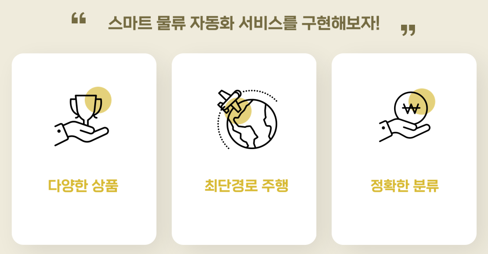
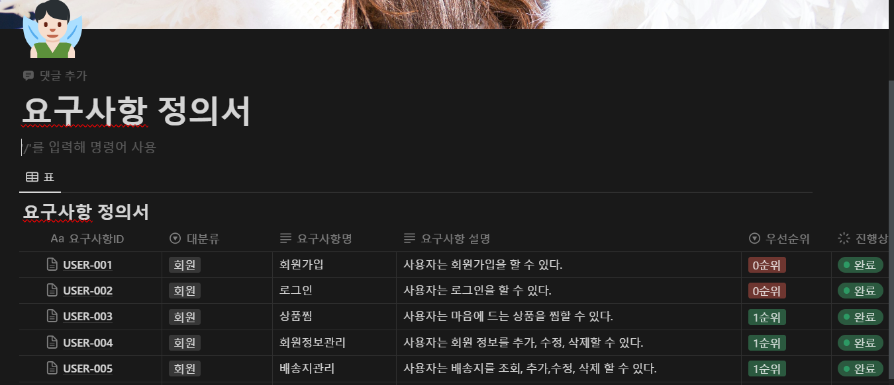
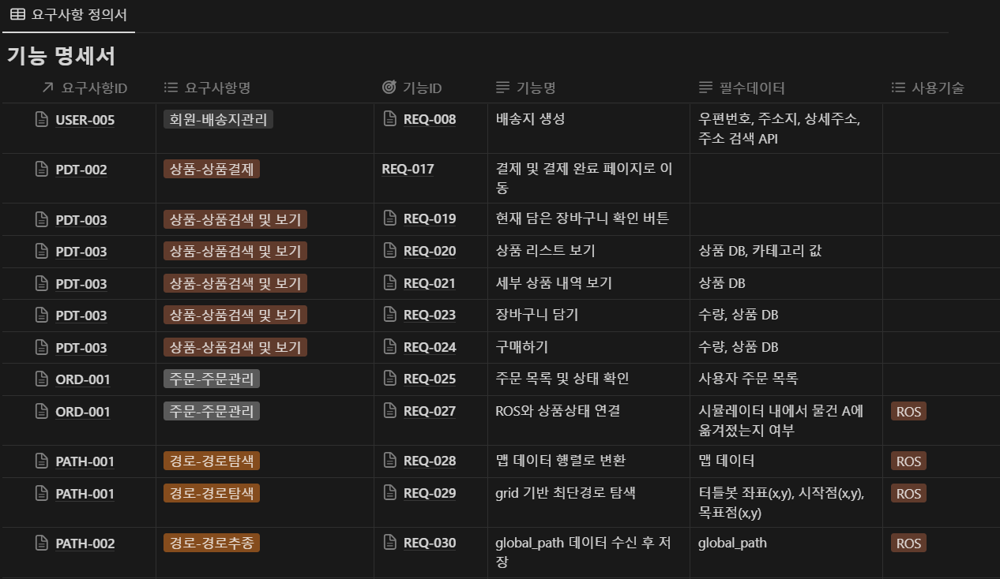
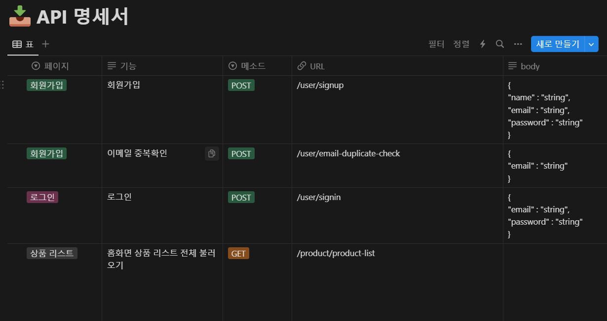
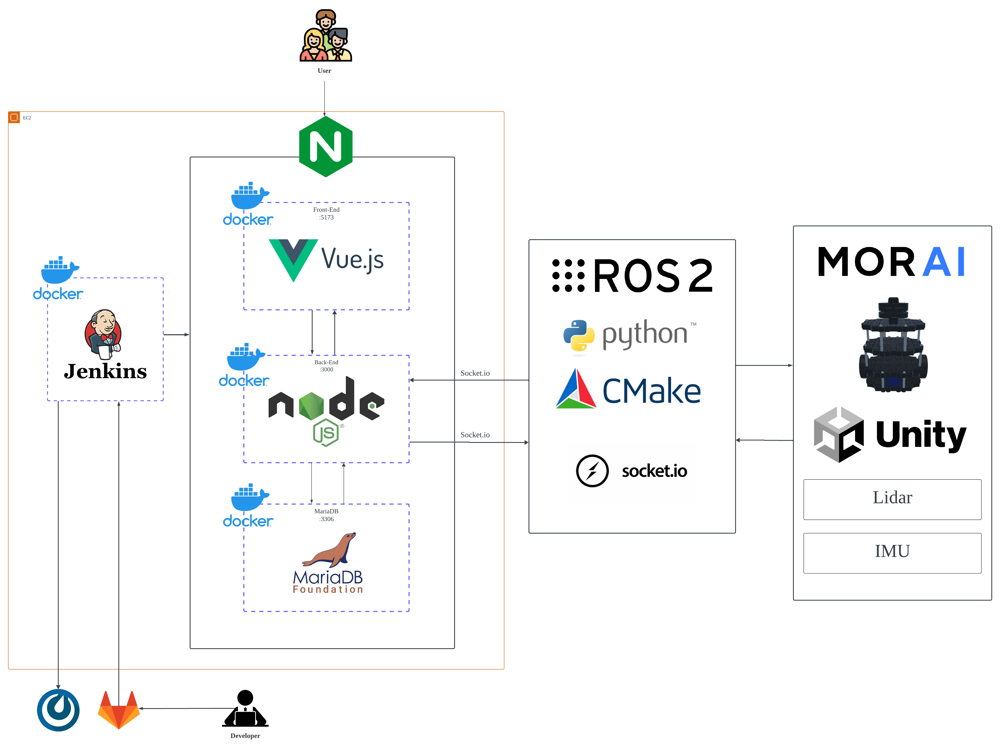

<html>
<body>

# 팀 C109(백구)

# **ROS** 와 **웹앱** 을 이용한 **물류 자동화 서비스**

## 팀원 소개 및 담당

## 기획배경

쿠팡, CJ 대항통운 등 많은 기업들이 물류 자동화를 통해 효율성 향상 및 빠른 물류 분류 및 처리 속도로 사용자들에게 매우 편리한 서비스를 제공하고 있습니다.

또한 전 세계적으로 스마트 팩토리 관심을 가지고 있고, 모두가 다 아는 삼성, LG, 현대 역시 제조 경쟁력을 갖추기 위해 스마트 팩토리에 투자를 진행하고 있습니다.

이러한 흐름에 맞춰 저희만의 스마트 팩토리 서비스를 구현하기로 계획했습니다.

따라서, 다양한 상품을 최단경로로 정확하게 분류하는 저희의 스마트 물류 자동화 서비스 구현헀습니다.

### 목표

</img>

### ERD

### 명세서

클릭시 상세 페이지로 이동

</img>

</img>

</img>

### 기술 스택

#### 백엔드

</img>

#### 프론트엔드

</img>

#### ROS

</img>

## 시스템 아키텍쳐

</img>

## 주요 기능 및 서비스

 

# ROS 및 자율주행 기능

## 맵

- 유니티 제작

## 구현 기능

</body>
</html>

